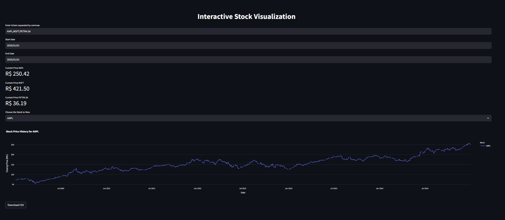

# Interactive Stock Visualization with Streamlit



## 📋 Description

This project allows users to visualize the historical stock prices of multiple stocks interactively in real-time using Streamlit and Plotly. By inputting a list of stock tickers (e.g., PETR4.SA, VALE3.SA, ITUB4.SA), the app fetches data from Yahoo Finance and displays an interactive line chart showing the stock prices over time. The application automatically updates every 30 seconds to ensure the displayed data remains current.

## 🚀 Features

- Input multiple stock tickers and view them simultaneously.

- Interactive graph with Plotly showing the historical closing prices.

- Real-time updates every 30 seconds.

- Display current stock prices in Streamlit's metric cards.

- Option to download the data as a CSV file.

## 🛠️ Technologies Used

- **Streamlit** for building the interactive web application.
- **Plotly** for interactive visualizations.
- **yfinance** to fetch stock data from Yahoo Finance.

## 📦 Installation

### Requirements

- Python 3.x
- Streamlit
- Plotly
- Pandas

### Installation Steps

1. Clone the repository:
    ```bash
    git clone https://github.com/IsaacMartins12/stocks_streamlite
    ```

2. Create virtual environment:
    ```bash
    python -m venv venv
    source venv/bin/activate # On Windows: venv\Scripts\activate


3. Install dependencies:
    ```bash
    python install -r requirements.txt

4. Run the main app:
    ```bash
    streamlit run stream.py

## 🧑‍💻 Contribution

We welcome contributions to improve this project. Feel free to submit pull requests or report issues on the [Issues page](https://github.com/IsaacMartins12/Smart-Energy-Meter/issues).

### Contribution Steps

1. Fork the project.
2. Create a branch for your feature (`git checkout -b feature/new-feature`).
3. Commit your changes (`git commit -am 'Add new feature'`).
4. Push to the branch (`git push origin feature/new-feature`).
5. Create a Pull Request with a detailed description of your changes.

## 📜 License

This project is licensed under the [MIT License](LICENSE).

